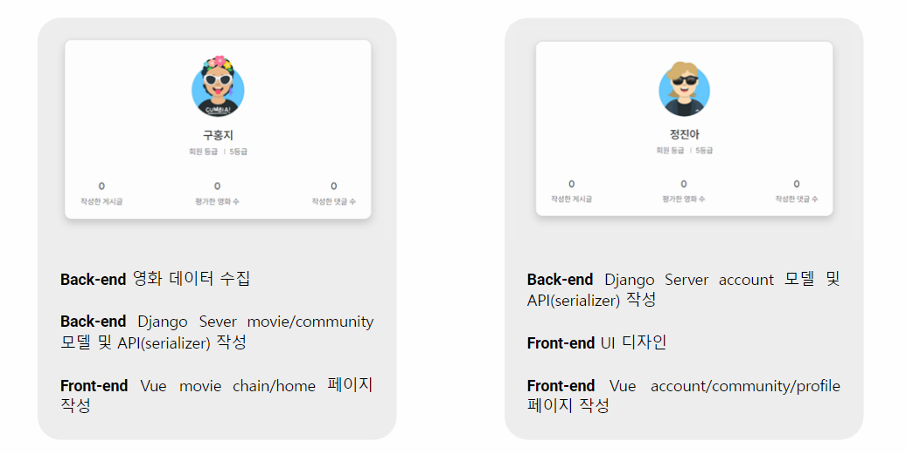
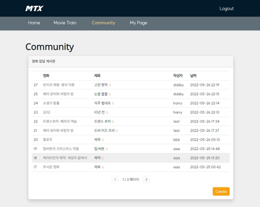
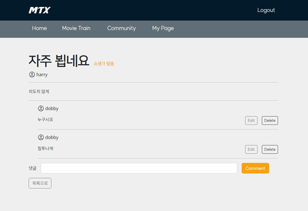

<h1 align="center">MTX : Movie Train eXpress 🚝</h1>

## 목차

[Description](#description)

[Team](#team-방학더조-mvvm-more-vacation-very-much)

[🎨 Tech Stack](#-tech-stack)

[✨ Service features](#-service-features)

[🎬 영화 추천 알고리즘 소개](#-영화-추천-알고리즘-소개)

​	[영화 제목 끝말 잇기](#영화-제목-끝말-잇기)

[🦩 데이터 베이스 모델링 (ERD)](#-데이터-베이스-모델링-erd)

[🔎 Overview](#-overview)

​	[1) Home](#1-home)	

​	[2) Account / Profile](#2-account--profile)

​	[3) Movie Train ⭐](#3-movie-train-)

​	[4) Movie Detail](#4-movie-detail)

​	[5) Community](#5-community)

​	[6) Admin](#6-admin)

[🎁 느낀점](#-느낀점)

​	[🍏 홍지](#-홍지)

​	[🍏 진아](#-진아)

## Description

> **영화 제목을 끝말잇기로 연속해서 보여주며, 사용자에게 영화를 추천하는 서비스입니다.**
>
> **끝말잇기라는 메인 아이디어에서 기차를 연상하여 서비스 이름, UI 등 전체적인 디자인 컨셉을 '기차🚝'로 설정했습니다.**

## 🤜🏻Team (방학더조, MVVM: More Vacation Very Much)🤛🏻

## 🎨 Tech Stack

## ✨ Service features

| type         | service(goal)                   | description(실제 구현 내용)                                  | access              |
| ------------ | ------------------------------- | ------------------------------------------------------------ | ------------------- |
| DB           | 영화 데이터 수집                | TMDB API를 사용하여 2000여개의 영화 데이터 수집              | admin               |
| Account      | 회원 가입 / 로그인 / 로그아웃   | `drf`의 `authtoken`을 통해 구현                              | all                 |
| Account      | 마이 페이지 및 프로필 페이지    | 유저 정보, 유저 등급, 리뷰 및 평점 남긴 영화 목록 조회 가능  | user                |
| Home         | DB 안의 영화 검색               | 검색어를 입력하여 DB의 영화를 검색하고, 검색 결과를 클릭하면 해당 영화의 디테일 페이지로 이동 | all                 |
| Home         | 일반 영화 추천                  | 1) 상영작, 개봉 예정작, 고전 명작, 현재 인기있는 영화와 비슷한 영화를 Carosel 형태로 추천  2) 포스터 클릭 시, Modal를 통해 해당 영화의 세부 정보 확인 가능 | all                 |
| Movie Train  | 끝말잇기를 통한 영화 추천 시작  | 1) 시작 단어를 입력하여 끝말잇기 영화 추천을 시작  2) 하단의 추천 검색어를 클릭하여 이동 가능 | all                 |
| Movie Train  | ⭐**끝말 잇기를 통한 영화 추천** | 1) 끝말 잇기 진행(해당 단어로 시작하는 영화 중 랜덤으로 하나 출력)  2) 화면 하단에서 끝말잇기 history 확인 가능  3) 바로 전 영화 페이지로 이동 가능 4) 영화 포스터 클릭 시 디테일 페이지로 이동 | all                 |
| Movie Detail | 영화 디테일                     | 1) 영화 상세 정보 및 리뷰 확인 가능  2) ⭐을 클릭해 별점 주기 가능(중복 불가)  3) 해당 영화의 리뷰 작성 가능 | all / user(2, 3)    |
| Community    | 리뷰 전체 목록 조회             | 1) 리뷰 전체 목록 확인 2) 영화 제목 클릭 시 영화 디테일 페이지로 이동  3) 리뷰 제목 클릭 시 리뷰 디테일 페이지로 이동 | user                |
| Community    | 리뷰 작성                       | 1) 리뷰 목록에서 리뷰 작성 form으로 이동 2) 영화 제목을 검색한 후 영화를 선택하여 해당 영화의 리뷰 작성 가능 | user                |
| Community    | 리뷰 디테일                     | 1) 리뷰 내용 및 리뷰에 해당하는 댓글 확인 가능  2) 리뷰나 댓글의 작성자 이름 클릭 시 작성자 프로필로 이동 | user                |
| Community    | 리뷰 수정 및 삭제               | 리뷰 디테일 페이지에서 리뷰 수정 / 삭제 버튼 클릭            | author              |
| Community    | 댓글 작성/수정/삭제             | 리뷰 디테일 페이지에서 댓글 1)작성 2)수정/삭제 가능          | user / author(2, 3) |
| Admin        | DB 조작                         | `django admin`을 사용해 영화, 유저, 리뷰 및 댓글의 정보 관리 | admin               |
| 404          | 404 NotFound                    | 등록되지 않은 url로 접근 시 404 페이지 반환                  | all                 |

## 🎬 영화 추천 알고리즘 소개

### 영화 제목 끝말 잇기

- 사용자 지정 검색어나 추천 검색를 입력하여 끝말 잇기를 시작한다. 해당 단어의 끝 글자로 시작하는 영화를 보여주면서 끝말잇기를 진행하게 된다.
- 해당 단어로 시작하는 단어가 영화가 여러개라면 그 중 랜덤으로 한 개를 보여주게 되는 구조이다.

## 🦩 데이터 베이스 모델링 (ERD)

## 🔎 Overview

### 1) Home

- 검색어를 입력하여 DB의 영화를 검색하고, 검색 결과를 클릭하면 해당 영화의 디테일 페이지로 이동한다.
- TMDB API를 사용하여 현재 상영작, 개봉 예정작, 고전 명작, 현재 인기있는 영화와 비슷한 영화를 Carosel 형태로 추천한다.
  - carosel은 자동으로 움직이지만 마우스로 grab하여 당길 수 있다.  
- 포스터 클릭 시, Modal를 통해 해당 영화의 세부 정보 확인이 가능하다.

### 2) Account / Profile

- 회원 가입 / 로그인 / 로그아웃
- 프로필 페이지: 유저 정보, 유저 등급, 리뷰 및 평점 남긴 영화 목록을 조회할 수 있다.

### 3) Movie Train ⭐

- 시작 단어를 입력하여 끝말잇기 영화 추천을 시작한다.  
- 하단의 추천 검색어를 클릭하여 이동 가능

- `>` (Next) 버튼을 클릭하여 끝말 잇기를 진행한다.
  - 해당 단어로 시작하는 영화 중 랜덤으로 하나 출력된다.
  - 끝말 잇기가 더 이상 이루어지지 않을 때, alert 창이 뜨며 총 몇 개의 영화를 연결시켰는지 알려준다.
- 화면 하단에서 끝말잇기 history 확인이 가능하다.
- `<` (Back) 클릭하여 바로 전 영화 페이지로 이동이 가능하고, 다시 `>` 버튼을 누르면 다른 랜덤 영화가 출력된다.
  - 더 이상 back할 수 있는 영화가 넘어가지 않을 때는, alert 창이 뜨며 끝말잇기 시작 페이지로 넘어간다.
- 영화 포스터 클릭 시 디테일 페이지로 이동한다.

### 4) Movie Detail

- 영화 상세 정보 확인이 가능하다.
- 로그인한 사용자라면, ⭐을 클릭해 별점 주기가 가능하다. 단, 이전에 해당 영화에 평점을 줬던 유저는 중복해서 평점을 줄 수 없다.  
- 해당 영화의 리뷰 확인이 가능하고, 로그인한 상태라면 영화의 리뷰를 작성할 수 있다.

### 5) Community

#### ❗ 커뮤니티 이용은 로그인한 user만 가능하다.

- 리뷰 전체 목록을 확인할 수 있다.
  - 영화 제목, 리뷰 제목, 작성자, 작성(수정) 날짜)  
- 영화 제목 클릭 시 영화 디테일 페이지로 이동한다.  
- 리뷰 제목 클릭 시 리뷰 디테일 페이지로 이동한다.
- create 버튼을 눌러 리뷰 작성 form으로 이동한다. 
  - 영화 제목을 검색한 후 영화를 선택하면 해당 영화의 리뷰 작성이 가능하다.

- 리뷰 내용 및 리뷰에 해당하는 댓글을 확인할 수 있다.  
- 리뷰나 댓글의 작성자 이름을 클릭 시, 작성자 프로필로 이동한다.
- 리뷰의 작성자라면 각 버튼을 눌러 리뷰 수정 및 삭제를 할 수 있다.
- 해당 리뷰에 대한 댓글을 작성/수정/삭제가 가능하다. 댓글의 수정 및 삭제 또한 댓글 작성자만 가능하다.

### 6) Admin

- `Django Admin`을 사용해 관리자만 영화, 유저, 리뷰 및 댓글의 서버 DB 관리를 할 수 있다.

## 🎁 느낀점

### 🍏 홍지

일주일 간의 최종 프로젝트를 드디어 완성했다! 알고리즘 기간 제외하고 3개월 동안 웹을 배웠는데, 그동안 배웠던 모든 지식을 써서 완성했다...😂 진짜 최종 프로젝트는 가장 완전한 복습 방법인 것 같다.. 또 배운 것들을 응용해서 한 단계 나아가 문제를 해결해보기도 했다. 조금 고단했지만 결국 해결했을 때의 기쁨이란! 이 맛에 개발하는구나를 느꼈다.

프로젝트를 진행하며 여러 에러 상황을 경험해 보는 게 중요하다는 생각이 들었다. 다음에 비슷한 에러를 마주했을 때 당황하지 않고 해결방법을 빠르게 고안해볼 수 있기 때문이다. 그리고 여러 공식 문서를 보는 힘을 길러야할 것 같다. (아직은 개인의 기술 블로그가 너무 편하다..😜)

기발하고도 구현 가능한 아이디어를 내 준 팀원 덕에, 기획 단계에서 큰 시간 소모 없이 프로젝트를 진행할 수 있었다. 그리고 팀원의 디자인 전공으로 예쁜 UI를 만들어주고, 내가 캐치하지 못했던 에러들을 꼼꼼하게 다뤄줘서 정말 감사하다. 일주일 동안 거의 하루에 12~15시간을 팀원과 함께하며 정이 많이 든 것 같다ㅎ 그리고 무사히 프로젝트를 완성할 수 있어서 더욱 기쁘다!! (기회가 된다면 배포까지 하고 싶다.)

### 🍏 진아

진짜 할 수 있을까 싶었던 프로젝트를 드디어 마무리 지었다. 그동안 배운 것들을 총 동원해 서비스를 꾸리게 되었는데 계속 뜯어보다 보니 정이 들었나. 기능 하나하나가 소중하고 의미있어 보인다. 그동안 아무 생각 없이 쓰던 많은 사이트들에도 이러한 노고가 들어갔다고 생각하니 새삼 개발자들이 대단하다고 느껴졌다.

이론과 실전이 달라 생각보다 애를 많이 먹었다. v-for문을 돌릴 때 key로 바인딩해야 하는 값은 변하면 안된다는 사실을 알고 있으면서도 막상 코드를 짤 때는 그 사실을 잊고 짜게 되어 고생 좀 했다. 또, Django에서 보내는 데이터 이름과 vue에서 받아 쓰는 데이터 이름이 서로 다른 경우도 있다는 걸 이번 프로젝트를 통해 알게 되었다. 번거롭더라도 지금 쓰는 코드 한 줄이 어떻게 진행되는지 확인해가면서 코딩하는 습관을 들여야 될 것 같다.

2인 1조로 하는 프로젝트라 합이 중요했는데, 똑똑하고 빠릿한 팀원과 함께해서 덕분에 무사히 프로젝트를 마칠 수 있었다고 생각한다. 지금 프로젝트를 이후에도 보강해서 더 재밌는 서비스로 발전시켜야겠다.

